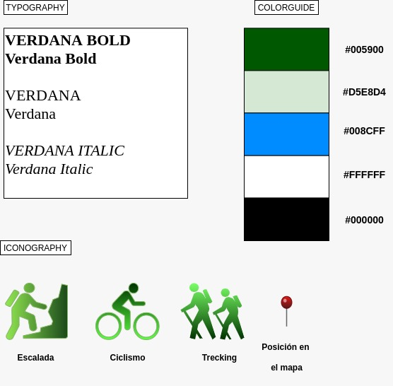

# Paso 3. MUSE MAP ANALYSIS 

## Reflexión sobre los métodos UX que han puesto en práctica para MuseMap, cuál creéis que ha sido más relevante y si hubieseis usado otro en vuestro lugar.

### Análisis de la competencia

Los diseñadores de MuseMap han realizado una tabla resumen, donde indican que ofrece o no cada competidor.
Vemos que esta muy bien, porque permite de un simple vistazo asimilar la información.
Nosotros únicamente describimos textualmente que ofrecía cada competidor y con esta técnica habría sido más eficaz ya que permite ver que tienen en común todos los competidores más fácilmente.

Por otro lado nosotros realizamos un Usability Review sobre un competidor que en MuseMap no se realiza. Creemos que esta revisión es muy importante porque nos permite extraer conclusiones sobre multitud de aspectos y evitar errores que ellos han cometido.

### Diseño Centrado en el Usuario para recabar información

Nos fijamos que en este apartado, los diseñadores de MuseMap han realizado diversos métodos antes de diseñar las personas.
Estás tareas son:

#### Empathy Map: 
> En el que plantean las carácteristicas que podrían tener sus usuarios potenciales, utilizan las conclusiones de este para plantear una serie de preguntas que llevarán a cabo en su siguiente método, las entrevistas a usuarios.

#### User Interview:
> Realizaron una entrevista a una serie de usuarios, de los que tomaron notas y destacaron las frases más relevantes.

#### Affinity Mapping:
> Buscan puntos en común entre los usuarios entrevistados.

Nosotros no hemos realizado estos tres puntos, y creemos que pueden ayudar a realizar un mejor diseño de las personas, especialmente gracias a las entrevistas.
No obstante creemos que las personas que diseñamos estan a la altura para cumplir su cometido, tanto como las que ha diseñado el equipo de MuseMap con mucho más esfuerzo.

#### Personas
Nos fijamos en que el dsieño de personas es muy similar al nuestro, con objetivos, frustaciones, bio, etc...

#### User Journey 
> La principal diferencia entre el realizado por los diseñadores de MuseMap y nosotros, es que ellos lo realizan sobre su futura aplicación y nosotros sobre un software real, del competidor que ofrece el producto más similar al nuestro

Creemos que en este caso, nuestro análisis es más ventajoso porque nos permite obtener un feedback más completo

#### Experience Map
> Viene a ser lo mismo que el user journey pero desglosando un poco más las acciones del usuario

No creemos que sea una herramienta muy útil, pues las conclusiones que se pueden sacar de el, se podían sacar también del user journey

### Problemas que debemos evitar, cosas que debemos incluir (como en la revisión de la usabilidad de la P1 y el feedback-capture-grid de la P2)

#### User flow:
En esta sección tenemos un concepto similar al de los diseñadores de MuseMap pero a diferencia de ellos nuestro flujo esta orientado a las tareas de la aplicación y no a los usuarios en si. Pensamos que ambos métodos son igualmente válidos.

#### Feature Prioritisation:
Los diseñadores de Muse Map han realizado una matriz de 2x2 en la que pueden situar los elementos del desarrollo en función de cuanto de necearios son y cuál es el esfuerzo de realizarlos. Por el contrario, nosotros hemos hecho una malla de receptora de información, la cual pensamos que es más útil puesto que nos aporta gran información de hacia donde tenemos que orientar el proyecto para conseguir un mejor resultado y no pensar tanto en el trabajo que costará realizarlo.

## Decisiones sobre patrones y diseño a aplicar en el prototipo de alta definición
Guia de colores: Para los colores hemos tomado la decisión de que el color predominante sea el verde para que el usuario relacione nuestra aplicación web con la naturaleza. 
> De modo que hemos tomado para los fondos un tono verde claro que no moleste a la hora de ver el contenido de la pagina y para bordes, iconos y barras un tono verde oscuro que resalten estos elementos. Para barras de navegación, filtros y algunos fondos hemos elegido en blanco por que es el más cómodo para ver la información que hay encima. Para algunos elementos y botones que queremos destacar hemos elegido un tono azul que hace que sean distintivos y a la vez es un color que no desentona con los tonos verdes y blanco del resto de la app. Y finalmente para la tipografía hemos elegido el color negro ya que es el que permite una mejor lectura de lo que hay escrito.

Tipografía: Para la tipografía hemos elegido la fuente "Verdana". 
> El motivo es que es una fuente de gran legibilidad y que, al contrario que otras fuentes, no hace que centres tu atención en la fuente permitiendo así una mejor lectura del contenido para el usuario. 

Al estar nuestra aplicación centrada tanto en el calendario como el mapa hemos investigado sobre el diseño de estos modulos y nos hemos encontrado con los siguientes articulos. 

> https://www.smashingmagazine.com/2010/08/the-importance-of-consistency-using-editorial-calendars-and-style-guides/
>
> https://www.smashingmagazine.com/2010/04/maps-in-modern-web-design/

En ellos hemos encontrado varias ideas sobre como podemos hacer que los modulos de mapa y calendario no solo sean el núcleo de nuestra aplicación sino tambien un elemento distintivo con el resto de webs competidoras.

## Vídeo 

> El vídeo se realizo grabando la pantalla mientras se hacía una video llamada. La vídeo llamada era algo de fondo, pero nos permite a ambos aparecer junto a la presentación.
> 
> En la primera parte del vídeo se habla sobre el producto, mientras que en la segunda parte se habla sobre el proceso de diseño que se ha llevado a cabo.
>
> [Ver Vídeo UX Case Story](https://player.vimeo.com/video/410735968)

## Valoración personal

> El desarrollo de esta tercera práctica nos ha ayudado a conocer herramientas distintas a las que hemos ido utilizando en el trascurso de la asignatura. Muchas de ellas nos han parecido muy interesantes de cara a utilizarlas en futuros proyectos y otras que nos han hecho cambiar y mejorar el diseño de esta práctica actual, como es el caso de los patrones de diseño para el mapa y el calendario. Por último destacar la importancia de una buena configuración de colores y tipografia para obtener un buen diseño en cualquier desarollo visual.

