# DIU3_Workers
Prácticas Diseño Interfaces de Usuario 2019-20 (Economía Colaborativa) 

Grupo: DIU3_Workers.  Curso: 2019/20 

Proyecto: Nature Sport

Descripción: Aplicación Web que permitirá a los usuarios organizar actividades deportivas (tales como trekking, montañismo o ciclismo), principalmente en entornos naturales.

Logotipo: 
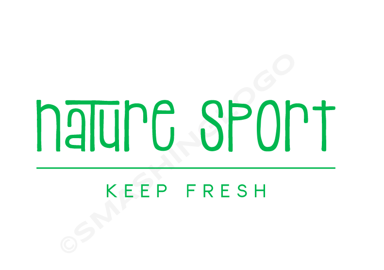

Miembros
 * :bust_in_silhouette:   Jose Saldaña Mercado     :octocat:     
 * :bust_in_silhouette:  Fernando Calvillo Parejo     :octocat:

----- 

# UX Case Study
## Nature Sport: keep fresh

¿Alguna vez te ha apetecido salir a hacer ejercicio a aire libre con alguien, y has acabado llendo solo o quedandote en tu casa? Puede que en la red, haya más gente igual que tu.

### ¿Quien se apunta a hacer deporte?

[Ver Vídeo UX Case Story](https://player.vimeo.com/video/410735968)

# 1 Introducción

#### ¿Habrá más gente con ganas de salir a hacer deporte?

> La respuesta a esta pregunta es la idea principal para crear Nature Sport. Nuestro cliente ficticio es el Ayuntamiento de Granada, una ciudad rodeada de bonitos parajes naturales, como la Vega del Genil, la Sierra de Huetor o la ladera de Sierra Nevada entre otros muchos.

#### Duración del sprint: 
> 2 meses

#### Miembros del equipo: 
> Jose Saldaña & Fernando Calvillo

----- 

### El objetivo de nuestro cliente es:
Fomentar el deporte en la provincia

Inculcar hábitos saludables en la población

Crear comunidades sociales 

El Ayuntamiento pretende exportar esta aplicación a otras regiones si funciona

----- 

# 2 Investigación de usuarios

## 2.1 La Oportunidad

Nos permite trabajar con:

> Mapas interactivos donde ver las distintas actividades que hay programadas.
>
> Calendarios interactivos donde ver las distintas actividades que hay programadas.
>
> Facilitar al usuario conectar con gente con intereses y aficiones similares.
>
> Permitir al usuario consultar un cátalogo de rutas por entornos naturales cerca de su hogar.

----- 

## 2.2 Usuarios potenciales y contexto

### ¿Quiénes son nuestros usuarios y que necesitan?

Personas de cualquier edad que valoren el entorno natural

Personas con ganas de conocer gente

Personas que quieran hacer deporte

### ¿En que entorno se encuentran nuestros usuarios?

Se encuentran en una sociedad que va a toda prisa, donde la gente se apunta al gimnasio porque es rápido

Se encuentran generalmente en un entorno urbano, cada vez más distanciado del mundo rural y la naturaleza

#### Nos fijamos en:
> Que podemos ofrecer a los usuarios una vía de escape de su rutina

----- 

#  3 Análisis de la competencia

Se analizan 5 plataformas de compartir experiencias, ya que ofrecen servicios similares a los que nosotros queremos ofrecer.
Más concretamente se analizan: Meetup, Planandgoapp, Eatwith, Timpik, Geokeda

 Finalmente realizamos un análisis más exhaustivo de Geokeda ya que nos resulta atractivo el home con el horario y el mapa. Para ver el análisis preliminar de las cinco compañías [haga click aquí](https://github.com/Josalmer/DIU3_Workers/blob/master/P1/competitive_analysis.pdf)

En dicho análisis de Geokeda realizamos una revisión de usabilidad, con la idea de obtener un feedback para nuestro futuro diseño. 
Las conclusiones de dicho análisis son:
> La web tiene algunas cosas bastante buenas, pero muchas cosas en las que mejorar. Como aspecto más destacable y grave, el tema de que la web no sea responsive, cosa que en los tiempos actuales no tiene mucho sentido porque el acceso a este tipo de sitios se realiza cada vez más desde dispositivos moviles.

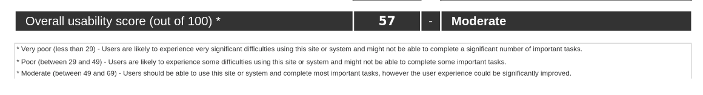

Si quiere ver el análisis de usabilidad completo [haga click aquí](https://github.com/Josalmer/DIU3_Workers/blob/master/P1/Usability-review.pdf)

----- 

#  4 Personas

### 4.1 Javier y Amanda

Diseñamos unas personas ficticias para utilizar distintos puntos de vista durante las pruebas de la UX, ya que es recomendable abstraernos y olvidarnos de nuestras inquietudes, para pasar a ponernos en el lugar de que haría un usuario que tiene sus propias circunstancias.

[Javier Crespo](https://github.com/Josalmer/DIU3_Workers/blob/master/P1/javier_crespo.png) y [Amanda García](https://github.com/Josalmer/DIU3_Workers/blob/master/P1/amanda.png)

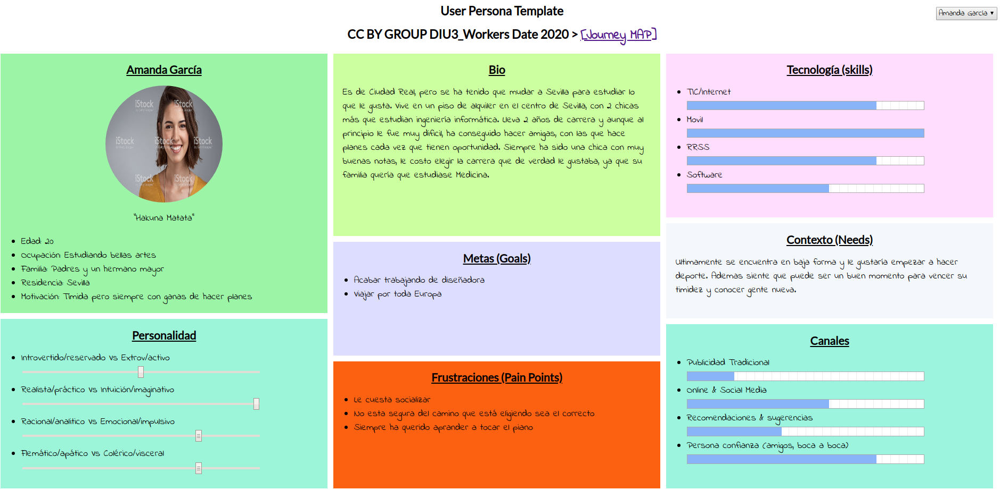

> Hemos elegido estas personas porque creemos que es muy representativo de la sociedad en la que vivimos. En la que la gente cada vez esta más centrada en su trabajo y deja más de lado su vida personal, y en la que muchas personas se ven presionadas a hacer algo que no les apetece, y cuando se guian por sus preferencias sienten inseguridad por no hacer caso a su entorno

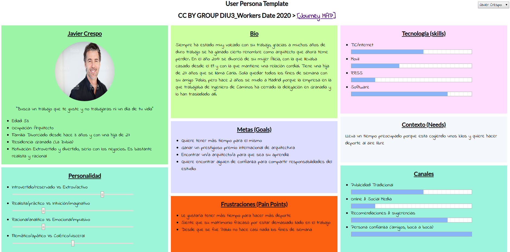

###  4.2 La experiencia de Javier y Amanda en Geokeda

Javier y Amanda quieren hacer senderismo y recurren a Geokeda

Experiencia de [Javier Crespo](https://github.com/Josalmer/DIU3_Workers/blob/master/P1/javier_journey.png) y experiencia de [Amanda García](https://github.com/Josalmer/DIU3_Workers/blob/master/P1/amanda_journey.png) 

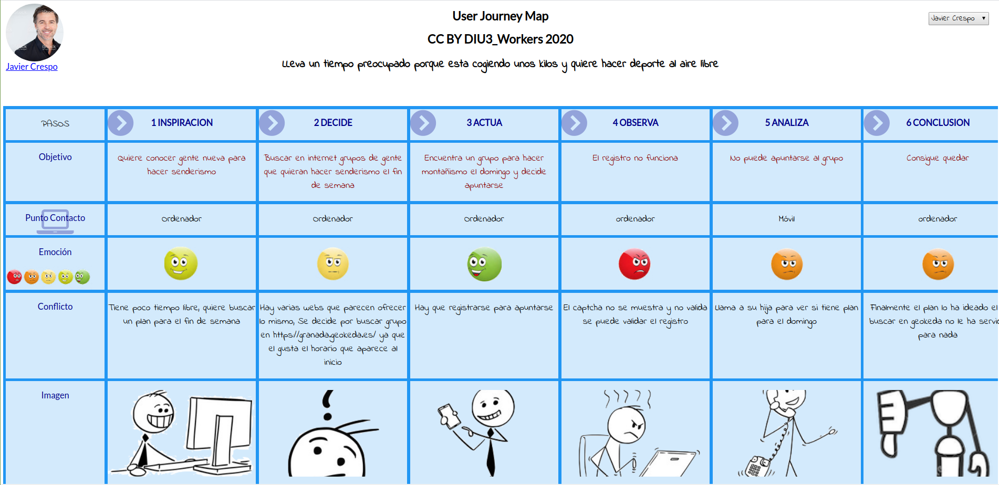

> Como podemos ver Amanda ha tenido más suerte que Javier. Cada vez la gente usa más la web para organizar planes sociales, creemos que experiencias similares a las que Javier y Amanda han tenido se dan con bastante frencuencia

----- 

# 5 Feedback de la investigación realizada con el análisis competitivo y la experiencia de nuestras personas

Con la idea de tener un punto de partida para el diseño de nuestra aplicación, tratamos de sintetizar las ideas obtenidas tras realizar el análisis competitivo y el análisis de la experiencia de nuestras personas

###  Malla receptora de información

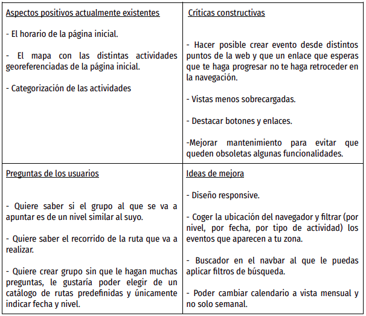

Tras analizar [toda esta información](https://github.com/Josalmer/DIU3_Workers/blob/master/P2/malla%20receptora%20de%20informacion.pdf), decidimos hacer una aplicación sencilla, intuitiva y rápida que girara en torno al calendario y el mapa. 
> Ambas herramientas en combinación nos darán fecha y localización mediante las cuales se filtraran los eventos que se muestran, si nos desplazamos en el mapa a Sevilla veremos los eventos en Sevilla, si desplazamos el calendario al mes de Mayo, veremos los eventos en en Sevilla el mes de Mayo. Por otro lado también se le dará importancia a un catálogo de rutas predefinidas que los administradores de la aplicación gestionaran.

----- 

# 6 Diseño

## 6.1 Task Flow

En este apartado vamos a definir la secuencia de pasos que los usuarios tendrán que realizar para llevar a cabo las principales tareas que la aplicación permite.
> Como usuario quiero crear un evento, consultar un evento, comentar en un evento, apuntarme a un evento, consultar las rutas predefinidas y crear una nueva ruta predefinida, [click aquí para ver todos](https://github.com/Josalmer/DIU3_Workers/blob/master/P2/task_flow.pdf)

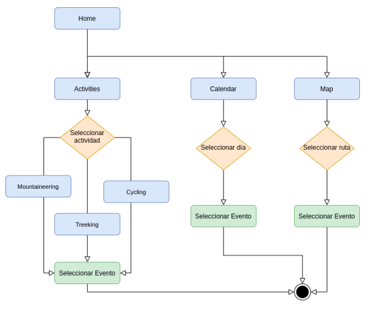

##  6.2 Sitemap y Labelling

[Mapa del sitio](https://github.com/Josalmer/DIU3_Workers/blob/master/P2/sitemap.pdf) que indica las distintas vistas que tendrá la aplicación y cómo se navega de unas a otras y [labelling o etiquetado](https://github.com/Josalmer/DIU3_Workers/blob/master/P2/labelling.pdf)

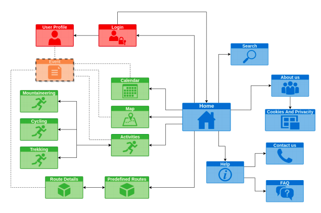

##  6.3 Wireframe y bocetos a mano

Inicialmente se realizan unos bocetos a mano y unos Wireframe centrandonos principalmente en como es van a distribuir los elementos en las distintas vistas. 

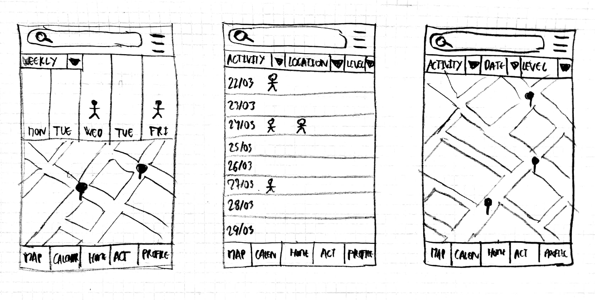

##  6.4 Guia de estilos

Guia de colores: Para los colores hemos tomado la decisión de que el color predominante sea el verde para que el usuario relacione nuestra aplicación web con la naturaleza. 
> De modo que hemos tomado para los fondos un tono verde claro que no moleste a la hora de ver el contenido de la pagina y para bordes, iconos y barras un tono verde oscuro que resalten estos elementos. Para barras de navegación, filtros y algunos fondos hemos elegido en blanco por que es el más cómodo para ver la información que hay encima. Para algunos elementos y botones que queremos destacar hemos elegido un tono azul que hace que sean distintivos y a la vez es un color que no desentona con los tonos verdes y blanco del resto de la app. Y finalmente para la tipografía hemos elegido el color negro ya que es el que permite una mejor lectura de lo que hay escrito.

Tipografía: Para la tipografía hemos elegido la fuente "Verdana". 
> El motivo es que es una fuente de gran legibilidad y que, al contrario que otras fuentes, no hace que centres tu atención en la fuente permitiendo así una mejor lectura del contenido para el usuario. 

## 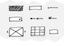 6.5 Patrones de diseño

Al estar nuestra aplicación centrada tanto en el calendario como el mapa hemos investigado sobre el diseño de estos modulos y nos hemos encontrado con los siguientes articulos. 

> https://www.smashingmagazine.com/2010/08/the-importance-of-consistency-using-editorial-calendars-and-style-guides/
>
> https://www.smashingmagazine.com/2010/04/maps-in-modern-web-design/

En ellos hemos encontrado varias ideas sobre como podemos hacer que los modulos de mapa y calendario no solo sean el núcleo de nuestra aplicación sino tambien un elemento distintivo con el resto de webs competidoras.

## 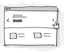 6.6 Bocetos Lo-Fi

Posteriormente se llevan a un siguiente nivel donde se pueda explicar mejor que hay en cada vista y como se distribuye, [click aquí para ver todos](https://github.com/Josalmer/DIU3_Workers/blob/master/P2/bocetos.pdf)

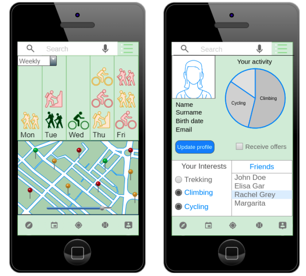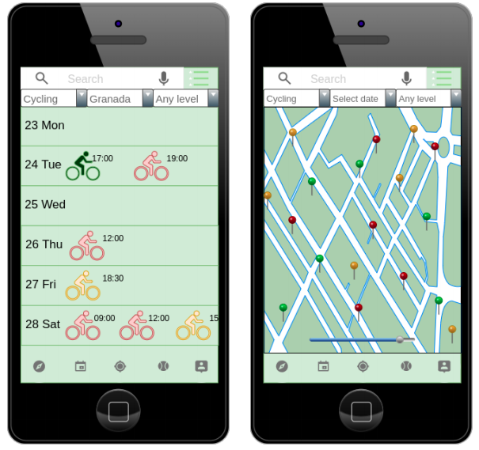
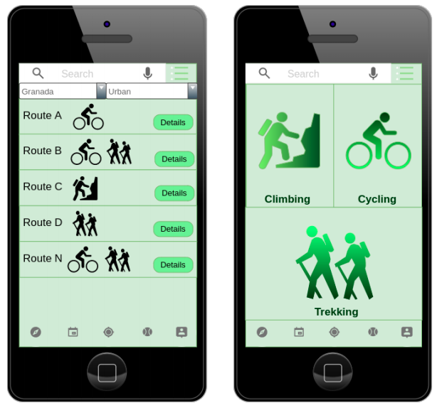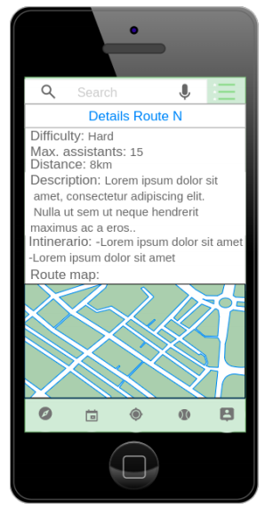