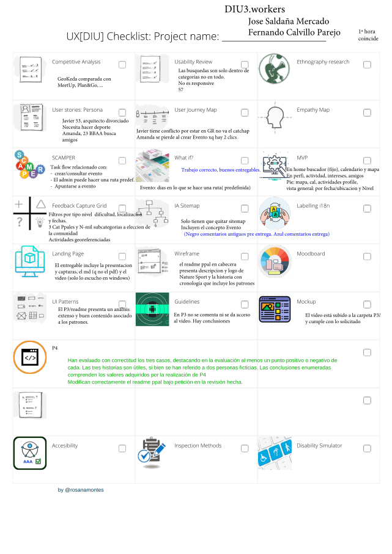

# EXTRA. Rediseño 

Tras recibir de parte de los profesores de la asignatura, los documentos que contienen el feedback del trabajo realizado ([clic aqui para ver rama beta, antes de realizar este rediseño](https://github.com/Josalmer/DIU3_Workers/tree/beta)), se lleva a cabo, por parte de Jose Saldaña, un análisis de dicho feedback, y se rediseñan los aspectos más significativos del mismo

## Feedback Profesores

Se comienza haciendo un análisis del feedback recibido de la profesora Dña Rosana Montes, para ver que aspectos se pueden mejorar en esta fase de rediseño.

>> A continuación se enumeran los aspectos identificados en este feedback que se van a rediseñar:
>> 
>> 1. Añadir enlace a vídeo desde readme de P3
>> 2. Añadir comentarios sobre vídeo en readme de P3

----- 

## Feedback Compañeros

A continuación se resume la valoración recibida por parte de los compañeros y se destacan los puntos que se van a rediseñar

> [DIU3.rushB    -- 85/100](https://github.com/Josalmer/DIU3_Workers/blob/master/rediseño/DIU3.workers_reviewby_DIU3.rushB.pdf)
>
> [DIU3.UserLAB  -- 97/100](https://github.com/Josalmer/DIU3_Workers/blob/master/rediseño/DIU3.workers_reviewby_DIU3.UserLAB.pdf)
>
> [DIU1.QWERTY   -- 86/100](https://github.com/Josalmer/DIU3_Workers/blob/master/rediseño/DIU3.workers_reviewedby_DIU1.QWERTY.pdf)
>
> [DIU2.MJ       -- 89/100](https://github.com/Josalmer/DIU3_Workers/blob/master/rediseño/DIU3.workers-reviewby_DIU2.MJ.pdf)
>
> Average        -- 89/100

>> A continuación se enumeran los aspectos identificados en este feedback que se van a rediseñar:
>>
>> 3. Añadir experiencia de Javier a readme principal
>> 4. Realizar User-Task-Matrix

----- 

## Rediseño

Se van a llevar a cabo las tareas indicadas en el apartado anterior 

> 1. Añadir enlace a vídeo desde readme de P3
> 2. Añadir comentarios sobre vídeo en readme de P3
> 3. Añadir experiencia de Javier a readme principal
> 4. Realizar User-Task-Matrix

> Destacar que cuando se realizo la práctica 2 se decidio hacer un User Task Flow en vez de una User Task Matrix, pero como a los compañeros no les ha gustado ya que han valorado con very poor el no haberla hecho (en vez de N/A), he pensado que añadirla puede darle un extra de completitud al trabajo realizado
> Se incluye el mismo tanto en la sección de la P2, como el nuevo punto 6.2 del readme principal.